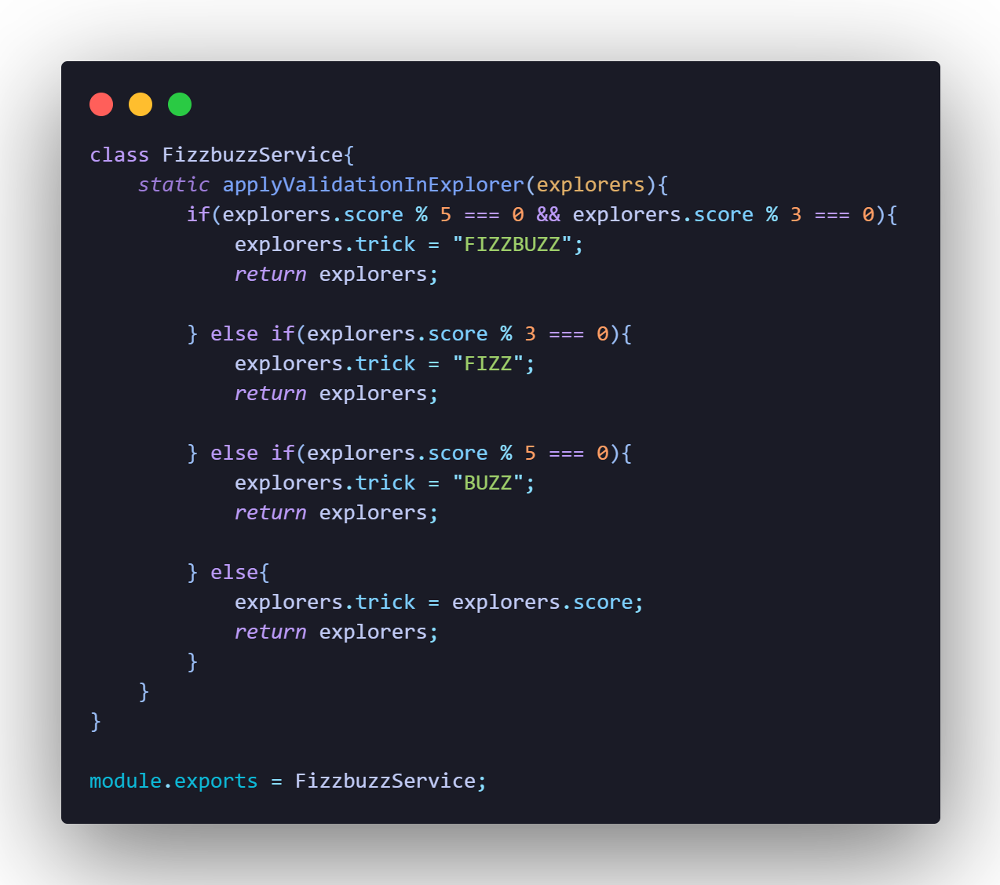

# FIZZBUZZ

Está práctica consiste en refactorizar el script legado de acuerdo a los requerimientos. Para está práctica se utilizó un archivo tipo json (se puede encontrar en el proyecto como explorers.json) que contiene a modo de ejemplo una lista de participantes en Launch X, a partir de la lista se realizará lo siguiente:

* Obtener la lista de explorers que solo estén en node.
* Obtener la cantidad de explorers que están en node.
* Obtener la lista de usuarios de github de los explorers que están en node.
* De acuerdo a la propiedad score del explorer o participante se hará una validación llamada FizzBuzz (de ahí el nombre de la práctica).

  **¿En que consiste está validación?**
  Si el participante tiene un score que sea divisible entre 3 y el modulo es 0 deberá tener un campo trick que diga FIZZ, si tiene un score divisible entre 5 y el modulo es 0 al campo trick se le asignará el valor BUZZ, si tiene un score que sea divisible entre 3 y 5, y el moduilo es 0 el campo trick tendrá el valor de FIZZBUZZ. En caso contrario, al campo trick se le asignará el valor del score.

Cabe aclarar que además de refactorizar el código, también se realizó lo siguiente:

* Se incluyeron pruebas unitarias con jest.
* Automatización de pruebas con GitHub Actions.
* Uso de Linter (ESLint).

**NOTA**
Antes de continuar se debe inicializar el proyecto con npm, para lo cuál se escribio el siguiente comando:

```
npm init
```

## 1. Refactorización

El script se modularizo en orientación a objetos para darle una mejor estructura.

Se crearon 3 archivos JavaScript:

* Reader.js: En esta clase necesitaremos un método static para leer el archivo y obtener la información dado el nombre archivo.
* ExplorerService.js: Aquí vamos poner tres métodos static para obtener lo que se necesita realizar con la lista de explorers. En este service vamos a realizar todas las operaciones de filtrado y mapeo que se necesiten.
* FizzbuzzService.js: Aquí haremos un método static para aplicar la validación sobre un explorer y agregarle el campo que se necesita.

### Reader.js

Para el archivo Reader.js se realizó lo siguiente:

* Se creo el archivo y carpetas necesarias en **lib/utils/Reader.js**.
* Dentro del archivo se creo una clase llamada Reader.
* Se creo un método static llamado readJsonFile que recibe un path (el path del archivo a leer).
* Se guardo la lógica para leer el archivo y se regreso la información.


En la imagen se puede observar que en la primera línea se importa el módulo del filesystem. Dentro de la clase se tiene el método que recibe un parametro, en este caso es el path el cual permite leer el archivo explorers.json
Por último, exportamos el archivo para que pueda ser utilizado en otras partes.

### ExplorerService.js

Para el archivo ExplorerService.js se realizó lo siguiente:

* Se creo el archivo y carpetas necesarias en **lib/services/ExplorerService.js**.
* Dentro del archivo se creo una clase llamada ExplorerService.
* Se crearon los siguientes métodos:
  * static filterByMission(explorers, mission)
  * static getAmountOfExplorersByMission(explorers, mission)
  * static getExplorersUsernameByMission(explorers, mission)


El primer método filterByMission, permite obtener la lista de explorers que solo estén en node para lo cuál se crea una constante llamada explorerByMission que será igual al nuevo array con todos los elementos que cumplan la condición implementada, esto se realiza haciendo uso del método filter, al final se retorna el nuevo array para que pueda ser visualizado.

El segundo método getAmountOfExplorersByMission, es parecido al anterior, solo que al momento de retornar se agrega la propiedad lenght que permite obtener precisamente la cantidad de explorers que están en node y no la lista.

Por último, el tercer método getExplorersUsernameByMission permite obtener la lista de usuarios de github de los explorers que están en node, para este caso primero se debe obtener la lista de quienes están en node, esto se realiza como el método anterior, filter. Una vez obtenido la lista de quienes están en node usamos el método map que nos permitirá obtener la lista de usuarios de github.

### FizzbuzzService.js

Para el archivo FizzbuzzService.js se realizó lo siguiente:

* Se creo el archivo y carpetas necesarias en **lib/services/FizzbuzzService.js**.
* Dentro del archivo se creo una clase llamada FizzbuzzService.
* Se crearon el siguiente métodos:
  * static applyValidationInExplorer(explorers)



El método recibe como parámetro la lista de explorers para que pueda realizar la validación, dicha validación ya se mencionó en un principio.
Para realizar está operación se hizo uso la estructura condicional "if".

## 2. Pruebas de unidad con Jest

Se instaló jest para poder realizar las pruebas de unidad, el comando para instalar jest es:
*`npm install --save-dev jest`*

Esto indica que se agrega la dependencia jest, y que se agrega para el ambiente de desarrollo --save-dev.

Se creo una carpeta especial para los test.

### Reader.test.js


En la primera linea se muestra que se esta importando la clase Reader para que las pruebas puedan funcionar.

En este caso las pruebas van enfocadas al path, o sea, al archivo explorers.json que contiene la lista de los explorers. Con estas pruebas se verifica si el archivo funciona correctamente

**Nota: La clase Reader esta al mismo nivel que el archivo explorers.json, por eso no se especifica la ruta en la const explores, sino que solo se pone el nombre del archivo.**

### ExplorerService.test.js


Para realizar esta prueba se necesito importar los archivos Reader.js y ExplorerService.js
El primer archivo se utiliza para la lista de los explorers y el segundo para que se puedan obtener los datos solicitados.

La constante explorers se pone de forma general para que pueda ser utilizada en todos los tes.

En el primer test se espera que la cantidad de explorers en node sean 10, de esta forma podemos comprobar la lista de explorers que están en node.

En el primer test se obtiene la lista de los explorers que están en node, en el expect mostramos el resultado esperado.

En el segundo test se obtiene la cantidad de explorers que están en node, como resultado esperado se pone el número 10 ya que es la cantidad de explorers.

En el tercer test se obtiene la lista de los nombres de usuarios de github de los explorers que están en node, en el resultado esperado se ponen los nombres de usuarios.

### FizzbuzzService.test.js


Para realizar esta prueba se tiene que importar la clase FizzbuzzService que contiene el método applyValidationInExplorer donde están las validaciones.

El primer test valida la propiedad score % 3, donde si no hay residuo a la propiedad trick se le asigna el valor FIZZ. Se crea una constante explorer que será igual a un objeto que tiene las propiedades name y score. Después, se crea otra constante llamada explorerFizz en donde se hará uso del método applyValidationInExplorer y se le envía como parámetro la constante creada anteriormente para que pueda hacer la validación. Como resultado esperado a la propiedad trick se le asigna FIZZ y como tal es correcto, ya que 3 / 3 el modulo es 0.

Y así sucesivamente ocurre con los demás test.

## 3. Automatización de pruebas con GitHub Actions

Para las pruebas automatizadas se tiene que crear un nuevo archivo con la ruta `.github/workflows/test.yml`

En el mismo archivo se tiene que copiar el siguiente código:

```
name: Run Tests in my project every push on GitHub

on: push
jobs:
  test:
    runs-on: ubuntu-latest
    steps:
      - uses: actions/checkout@v2
      - name: Setup Node.js
        uses: actions/setup-node@v1
        with:
          node-version: "12"

      # Speed up subsequent runs with caching
      - name: Cache node modules
        uses: actions/cache@v2
        env:
          cache-name: cache-node-modules
        with:
          # npm cache files are stored in `~/.npm` on Linux/macOS
          path: ~/.npm
          key: ${{ runner.os }}-build-${{ env.cache-name }}-${{ hashFiles('**/package-lock.json') }}
          restore-keys: |
            ${{ runner.os }}-build-${{ env.cache-name }}-
            ${{ runner.os }}-build-
            ${{ runner.os }}-

      # Install required deps for action
      - name: Install Dependencies
        run: npm install

      # Finally, run our tests
      - name: Run the tests
        run: npm test
```

Este es un GitHub Action que automatiza la ejecución de las pruebas cada vez que se haga un PUSH al repositorio de GitHub.

**Notas**

* El comando "on" significa que esta prueba se va a realizar cada que se haga un push, cada que se hagan nuevos cambios.
* El comando "runs-on" indica que va a montar un contenedor (máquina vritual), en este caso sería ubuntu.
* EL step github actions abstrae las herramientas que necesitamos, uno es para bajar cossas de git y el otro para correr jest.

## 4. Linter

JS y cada lenguaje tienen herramientas para ayudarnos a cuidar la legibilidad en nuestro código, se les conoce como linters.

Para este proyecto se utilizo ESLint, para instalarlo solo se necesita el siguiente comando `npm install eslint --save-de`

Después, se debe de ejecutar el siguiente comando `npm init @eslint/config` para generar la configuración del linter.

Para este proyecto se utilizo la siguiente configuración:


Al finalizar la configuración se creará un archivo llamado `.eslintrc.js`

Dentro del archivo podemos encontrar los rules que son reglas que podemos decirle al Linter que revise en nuestros archivos, nos ayudan a detectar mejoras de escritura.

Dentro de las reglas que hemos definido tenemos las siguientes:

```
"rules": {
        indent: ["error", 4],
        "linebreak-style": ["error", "unix"],
        quotes: ["error", "double"],
        semi: ["error", "always"]
    }
```

    ->INDENT : Identación (2, 4 espacios o uso de tabs).
    ->QUOTES: Comillas (dobles o simples).
    ->SEMI: Punto y coma (nunca o siempre).

También se cuenta con la documentación si en dado se necesitará saber más de las reglas: https://eslint.org/docs/rules/

Una vez definidas las reglas tenemos que ejecutar el siguiente comando `npm run linter` para que el linter se ejecute y muestre todas las inconsistencias de escritura.

Para arreglar todas las inconsistencias de escritura debemos de ejecutar el siguiente comando `npm run linter-fix` y con eso los archivos quedarán con el formato definido en las reglas.

**Notas finales**

Dependencias necesarias:

* EsLint
* Node
* Jest
* GitHub Actions

Refactorizar = Modularizar: Se trata de darle estructura a lo que tenemos

Tecnica para refactorizar: Orientación a objetos con pruebas

Debuggear: Probar paso a paso (puede ser aplicando console.log)
